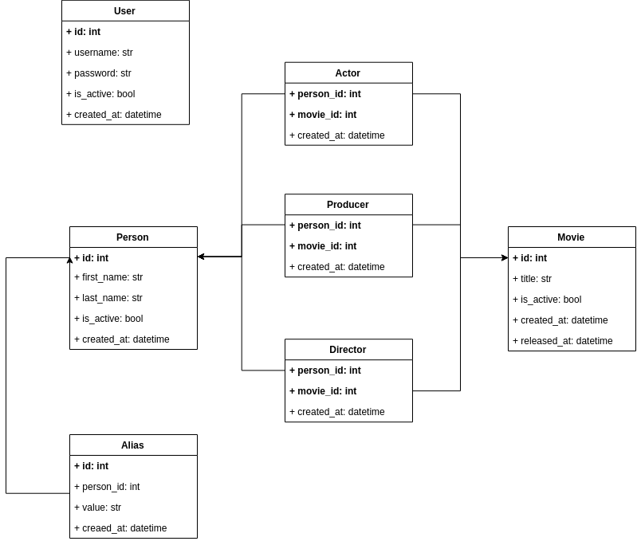

# Business Model

### Models
Provide a REST API to access movies and persons models.
You can add any extra field/relationship but the ones described here are mandatory.

##### Person
* Id
* Last Name
* First Name
* Aliases
* Movies as Actor/Actress
* Movies as Director
* Movies as Producer

##### Movie
* Id
* Title
* Release Year
* Casting (Actors + Actresses)
* Directors
* Producers

# Database Model

